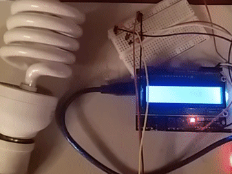

# alarm-lamp

Simple Arduino project that switches on a lamp at a specified hour. Made for fun (and to help me wake up in the morning) but hope it's useful to someone else! 

Developed with the Arduino extension for Visual Studio Code. Nice choice if you want an upgrade over the default Arduino IDE!

## Requirements

### DS3231 Library

Requires the [DS3231 library](http://www.rinkydinkelectronics.com/library.php?id=73) by Rinky Dink Electronics. If you're using a ZS-042 DS3231 with a CR2032 coin battery, please remove the resistor marked as '201' or the 1N4148 diode as shown in the attached image [in this post.](https://forum.arduino.cc/index.php?topic=278270.msg2916047#msg2916047) If you do not, you risk the CR2032 swelling and popping out!

## Assembly

### Components

* Arduino UNO
* [16x2 LCD Keypad Shield](https://www.elecrow.com/lcd-keypad-shield-for-arduino-p-311.html)
* 1 channel relay
* DS3231 RTC module
* Lamp

### Hook-up

The shield is hooked up to the default digital pins, but adjust them if you're using a different model. The relay's signal pin is connected to ``D2`` and the RTC module is connected via I²C to ``A4 (SDA)`` and ``A5 (SCL)``. Both are connected to 5V and GND.  

The relay is connected to the lamp via C and NO. If you have never worked with a relay before and not sure what that means, refer to [this image.](http://www.circuitbasics.com/wp-content/uploads/2015/11/Arduino-Temperature-Dependent-Light-Bulb-With-5V-Relay-Updated.png) Please be careful when working with main voltage!

## Usage

The ``setup()`` function has some commented-out lines to set the RTC time.  A line for loading the saved alarm time from the EEPROM is also commented out, and should be uncommented and the sketch re-uploaded after having set the alarm once.

Once uploaded, the LCD defaults to a screen that shows the current time and set alarm time. By pressing ``select`` on the keypad, you will switch to the alarm setting screen, from where you can set the alarm time using the directional buttons. Press ``select`` again to save the alarm time and return to the inital screen.

After the alarm time is reached, the lamp will turn on and stay on! To turn it off, you'll have to hit the reset button on the Arduino.

## Files

``main.ino`` contains the majority of the logic. ``characters.ino`` contains the definitions for the custom characters used on the LCD screen, and ``designs.pdn`` is a Paint.NET file where I designed the characters before writing them as byte arrays.

## Roadmap

*(AKA stuff I'd love to do, but no idea if I'll actually do)*

* It'd be great to break the alarm logic into its own class/file to reduce the clutter in ``main.ino``
* The input code is pretty much a hack (it avoids detecting multiple presses via a delay between each reading) so I'd love to implement a library to read input properly or maybe write my own
* It'd be interesting to switch the lamp for an RGB LED that turns on gradually (emulating a sun rise or something like that)

